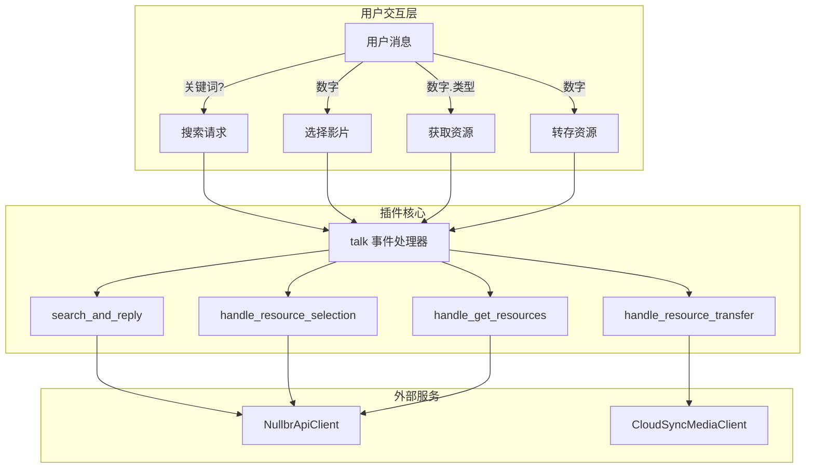
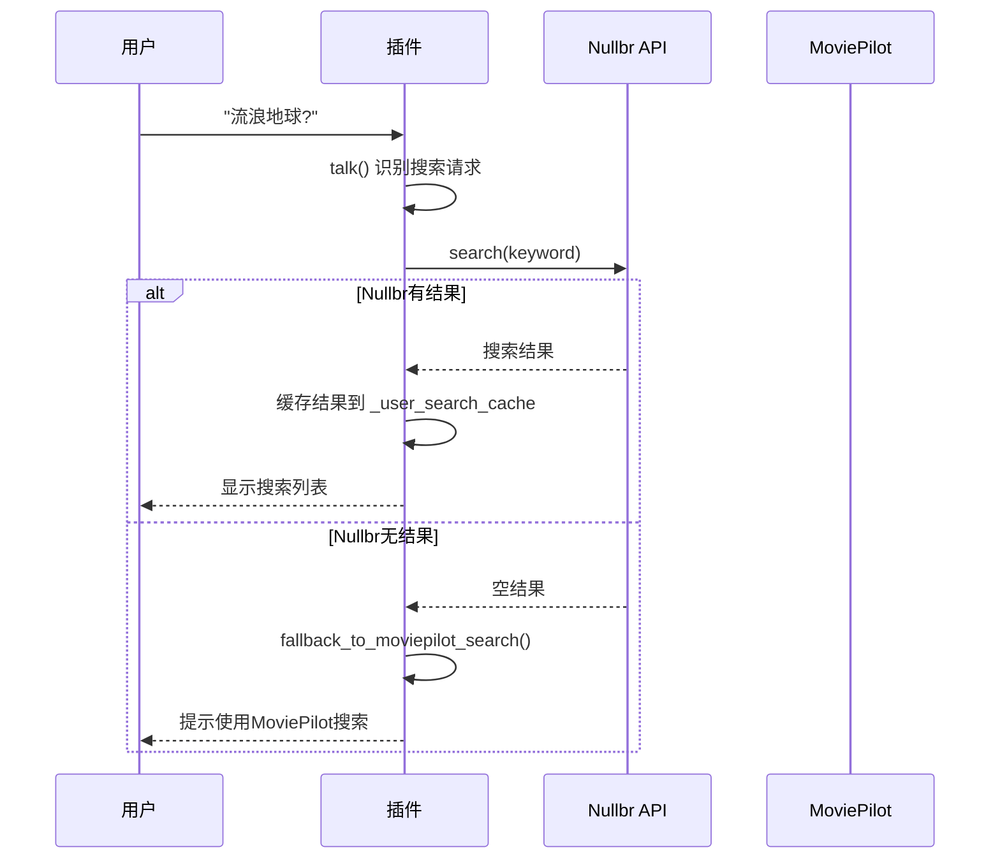
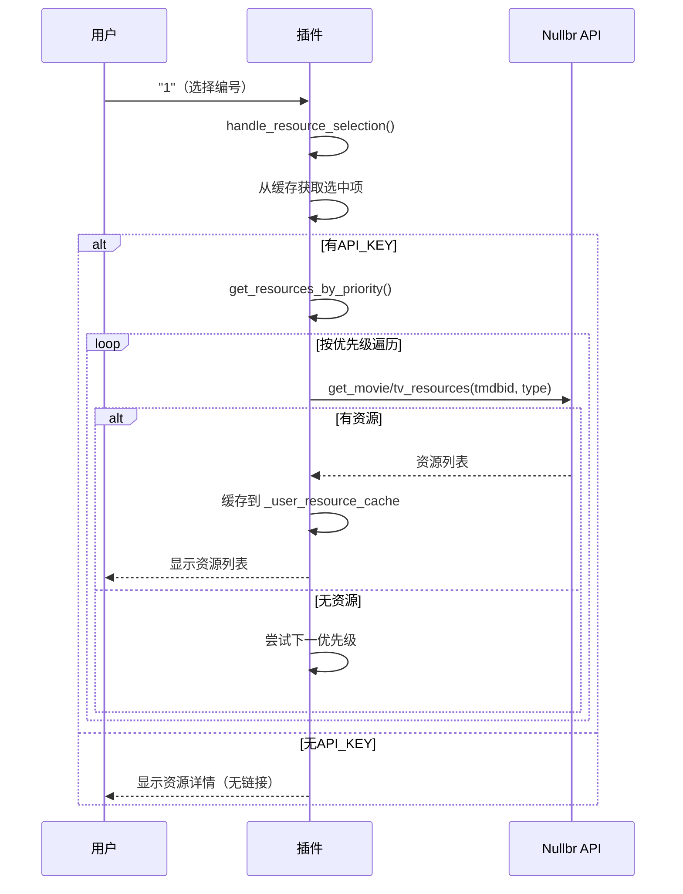
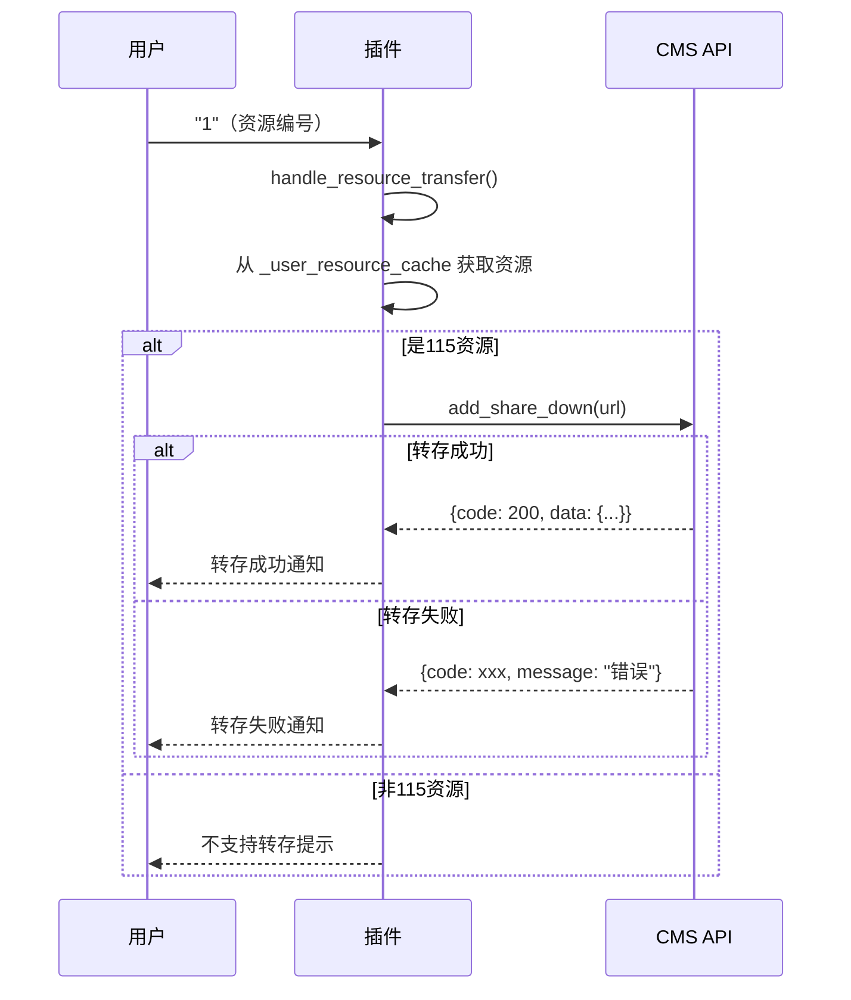

# nullbr_search 插件实现分析

> 本文档详细分析 `nullbr_search` 插件的完整实现，为后续开发提供参考。

---

## 目录

1. [插件概览](#1-插件概览)
2. [架构设计](#2-架构设计)
3. [核心文件分析](#3-核心文件分析)
4. [交互流程详解](#4-交互流程详解)
5. [关键实现细节](#5-关键实现细节)
6. [API客户端实现](#6-api客户端实现)
7. [CMS转存实现](#7-cms转存实现)
8. [配置界面实现](#8-配置界面实现)
9. [缓存机制](#9-缓存机制)
10. [开发参考](#10-开发参考)

---

## 1. 插件概览

### 1.1 基本信息

| 属性 | 值 |
|------|-----|
| 插件名称 | Nullbr资源搜索 |
| 版本 | 2.0.1 |
| 作者 | Hqyel |
| 配置前缀 | `nullbr_search_` |
| 权限等级 | 1（所有用户） |

### 1.2 功能特性

- **资源搜索**: 支持 115网盘、磁力、ED2K、M3U8 等多种资源类型
- **优先级配置**: 用户可自定义资源获取的优先级顺序
- **CMS转存**: 集成 CloudSyncMedia，支持自动转存到云盘
- **回退机制**: Nullbr 无结果时自动回退到 MoviePilot 原始搜索
- **多渠道适配**: 消息格式自动适配微信等不同通知渠道

---

## 2. 架构设计

### 2.1 整体架构



### 2.2 文件结构

```
plugins.v2/nullbr_search/
├── __init__.py        # 插件主类（1462行）
├── nullbr_client.py   # Nullbr API 客户端（202行）
└── cms_client.py      # CMS 转存客户端（110行）
```

---

## 3. 核心文件分析

### 3.1 `__init__.py` - 插件主类

#### 类定义与元信息

```python
class nullbr_search(_PluginBase):
    # 插件基本信息
    plugin_name = "Nullbr资源搜索"
    plugin_desc = "支持nullbr api接口直接搜索影视资源..."
    plugin_icon = "https://raw.githubusercontent.com/Hqyel/MoviePilot-Plugins/main/icons/nullbr.png"
    plugin_version = "2.0.1"
    plugin_author = "Hqyel"
    author_url = "https://github.com/Hqyel"
    plugin_config_prefix = "nullbr_search_"
    plugin_order = 1
    auth_level = 1
```

#### 实例变量

```python
def __init__(self):
    super().__init__()
    # 基本配置
    self._enabled = False              # 插件启用状态
    self._app_id = None                # Nullbr API ID
    self._api_key = None               # Nullbr API Key
    self._resource_priority = [...]    # 资源优先级
    self._enable_115 = True            # 各资源类型开关
    self._enable_magnet = True
    self._enable_video = True
    self._enable_ed2k = True
    self._search_timeout = 30          # 搜索超时
    
    # CMS配置
    self._cms_enabled = False
    self._cms_url = ""
    self._cms_username = ""
    self._cms_password = ""
    
    # 客户端实例
    self._client = None                # Nullbr客户端
    self._cms_client = None            # CMS客户端
    
    # 缓存
    self._user_search_cache = {}       # 搜索结果缓存
    self._user_resource_cache = {}     # 资源缓存
    
    # 统计数据
    self._stats = {...}                # 运行统计
```

### 3.2 核心方法清单

| 方法 | 作用 | 行号 |
|------|------|------|
| `init_plugin` | 初始化配置和客户端 | 131-198 |
| `get_form` | 配置页面 | 213-651 |
| `talk` | 事件监听入口 | 662-749 |
| `search_and_reply` | 搜索并回复 | 751-862 |
| `handle_resource_selection` | 处理选择 | 864-954 |
| `handle_get_resources` | 获取资源 | 956-1049 |
| `get_resources_by_priority` | 按优先级获取 | 1051-1140 |
| `handle_resource_transfer` | CMS转存 | 1142-1273 |
| `format_and_send_resources` | 格式化资源 | 1275-1370 |
| `fallback_to_moviepilot_search` | 回退搜索 | 1372-1422 |
| `stop_service` | 停止服务 | 1437-1458 |

---

## 4. 交互流程详解

### 4.1 搜索流程



### 4.2 资源选择流程



### 4.3 CMS转存流程



---

## 5. 关键实现细节

### 5.1 消息识别规则

```python
@eventmanager.register(EventType.UserMessage)
def talk(self, event: Event):
    text = event.event_data.get("text")
    clean_text = text.rstrip('？?').strip()
    
    # 规则1: 资源获取请求 "数字.类型"
    if re.match(r'^\d+\.(115|magnet|video|ed2k)$', clean_text):
        # 如 "1.115?" "2.magnet"
        self.handle_get_resources(number, resource_type, channel, userid)
    
    # 规则2: 编号选择（纯数字）
    elif clean_text.isdigit():
        # 先检查是否有资源缓存（用于转存）
        if userid in self._user_resource_cache:
            self.handle_resource_transfer(number, channel, userid)
        else:
            # 否则视为影片选择
            self.handle_resource_selection(number, channel, userid)
    
    # 规则3: 搜索请求（以?结尾）
    elif text.endswith('？') or text.endswith('?'):
        self.search_and_reply(keyword, channel, userid)
```

### 5.2 优先级资源获取

```python
def get_resources_by_priority(self, selected: dict, channel: str, userid: str):
    # 按配置的优先级顺序遍历
    for priority_type in self._resource_priority:  # ["115", "magnet", "ed2k", "video"]
        # 检查资源类型是否可用
        flag_key = f"{priority_type}-flg"
        if not selected.get(flag_key):
            continue
        
        # 检查是否启用
        enable_key = f"_enable_{priority_type}"
        if not getattr(self, enable_key, True):
            continue
        
        # 尝试获取资源
        resources = self._client.get_movie_resources(tmdbid, priority_type)
        if resources and resources.get(priority_type):
            self.format_and_send_resources(resources, priority_type, title, channel, userid)
            return
    
    # 所有优先级都失败，回退
    self.fallback_to_moviepilot_search(title, channel, userid)
```

### 5.3 微信消息格式适配

```python
def _format_message_for_wechat(self, text: str) -> str:
    """处理微信企业应用的特殊格式需求"""
    lines = text.split('\n')
    formatted_lines = []
    
    for line in lines:
        stripped = line.strip()
        
        # 空行合并
        if not stripped:
            if formatted_lines and formatted_lines[-1] != '':
                formatted_lines.append('')
            continue
        
        # 标题行（带emoji）前后加空行
        if ('🎬' in stripped or '🎯' in stripped) and '：' in stripped:
            if formatted_lines and formatted_lines[-1] != '':
                formatted_lines.append('')
            formatted_lines.append(stripped)
            formatted_lines.append('')
        else:
            formatted_lines.append(stripped)
    
    return '\n'.join(formatted_lines)

def post_message(self, channel, title: str, text: str, userid: str = None):
    # 检测微信渠道
    if 'wechat' in channel_name or 'wecom' in channel_name:
        formatted_text = self._format_message_for_wechat(text)
    else:
        formatted_text = text
    
    super().post_message(channel=channel, title=title, text=formatted_text, userid=userid)
```

---

## 6. API客户端实现

### 6.1 `NullbrApiClient` 类

```python
class NullbrApiClient:
    def __init__(self, app_id: str, api_key: str = None):
        self._app_id = app_id
        self._api_key = api_key
        self._base_url = "https://api.nullbr.eu.org"
        
        # 配置Session
        self._session = requests.Session()
        self._session.headers.update({
            'User-Agent': 'MoviePilot-NullbrSearch/1.0.4',
            'Content-Type': 'application/json'
        })
        
        # 重试策略
        retry_strategy = Retry(
            total=3,
            status_forcelist=[429, 500, 502, 503, 504, 408],
            backoff_factor=1,
            allowed_methods=["HEAD", "GET", "OPTIONS"]
        )
        adapter = HTTPAdapter(max_retries=retry_strategy)
        self._session.mount("http://", adapter)
        self._session.mount("https://", adapter)
```

### 6.2 代理降级策略

```python
def _make_request(self, url: str, params: dict, headers: dict, use_proxy: bool = True):
    """支持代理与直连的降级"""
    if not use_proxy:
        session = requests.Session()
        session.headers.update(self._session.headers)
        session.proxies = {'http': None, 'https': None}
    else:
        session = self._session
    
    timeout = 5 if use_proxy else (10, 30)
    return session.get(url, params=params, headers=headers, timeout=timeout)

def search(self, query: str, page: int = 1) -> Optional[Dict]:
    # 先尝试代理
    try:
        response = self._make_request(url, params, headers, use_proxy=True)
    except (Timeout, ConnectionError) as e:
        # 代理失败，尝试直连
        response = self._make_request(url, params, headers, use_proxy=False)
```

### 6.3 API端点

| 端点 | 方法 | 功能 |
|------|------|------|
| `/search` | GET | 搜索影视资源 |
| `/movie/{tmdbid}/{type}` | GET | 获取电影资源 |
| `/tv/{tmdbid}/{type}` | GET | 获取剧集资源 |

---

## 7. CMS转存实现

### 7.1 `CloudSyncMediaClient` 类

```python
class CloudSyncMediaClient:
    def __init__(self, base_url: str, username: str, password: str):
        self.base_url = base_url.rstrip('/')
        self.username = username
        self.password = password
        self.token = None
        self.token_expiry = 0
        
        self.session = requests.Session()
        self.session.headers.update({
            'Content-Type': 'application/json',
            'Accept': 'application/json'
        })
        
        # 内网服务禁用代理
        self.session.proxies = {'http': None, 'https': None}
        
        # 初始化时获取token
        self._ensure_valid_token()
```

### 7.2 Token管理

```python
def _ensure_valid_token(self):
    """确保有效的token，自动刷新"""
    current_time = time.time()
    
    # token不存在或距离过期不到1小时
    if not self.token or current_time >= (self.token_expiry - 3600):
        login_data = self._login()
        self.token = login_data['token']
        self.token_expiry = current_time + 86400  # 24小时过期
        
        self.session.headers.update({
            'Authorization': f'Bearer {self.token}'
        })

def add_share_down(self, url: str) -> dict:
    """添加分享链接进行转存，带401自动重试"""
    try:
        self._ensure_valid_token()
        response = self.session.post(
            f'{self.base_url}/api/cloud/add_share_down',
            json={'url': url},
            timeout=(10, 30)
        )
        return response.json()
    except HTTPError as e:
        if e.response.status_code == 401:
            # 强制刷新token并重试
            self.token = None
            self._ensure_valid_token()
            # 重试...
```

---

## 8. 配置界面实现

### 8.1 Vuetify JSON结构

```python
def get_form(self) -> Tuple[List[dict], Dict[str, Any]]:
    return [
        {
            'component': 'VForm',
            'content': [
                # 提示信息
                {'component': 'VAlert', 'props': {'type': 'info', 'text': '...'}},
                
                # 启用开关
                {'component': 'VSwitch', 'props': {'model': 'enabled', 'label': '启用插件'}},
                
                # API配置
                {'component': 'VTextField', 'props': {'model': 'app_id', 'label': 'APP_ID'}},
                {'component': 'VTextField', 'props': {'model': 'api_key', 'type': 'password'}},
                
                # 高级设置（折叠面板）
                {
                    'component': 'VExpansionPanels',
                    'content': [
                        {
                            'component': 'VExpansionPanel',
                            'props': {'title': '⚙️ 高级设置'},
                            'content': [
                                # 资源类型开关
                                {'component': 'VSwitch', 'props': {'model': 'enable_115'}},
                                # 优先级选择
                                {'component': 'VSelect', 'props': {'model': 'priority_1', 'items': [...]}}
                                # CMS配置
                                # ...
                            ]
                        }
                    ]
                }
            ]
        }
    ], {
        # 默认值
        "enabled": False,
        "app_id": "",
        "api_key": "",
        "enable_115": True,
        "priority_1": "115",
        # ...
    }
```

### 8.2 配置项说明

| 配置项 | 类型 | 默认值 | 说明 |
|--------|------|--------|------|
| `enabled` | bool | False | 插件开关 |
| `app_id` | str | "" | Nullbr APP ID（必填） |
| `api_key` | str | "" | Nullbr API Key（获取链接需要） |
| `enable_115/magnet/video/ed2k` | bool | True | 资源类型开关 |
| `priority_1~4` | str | 115/magnet/ed2k/video | 优先级设置 |
| `cms_enabled` | bool | False | CMS转存开关 |
| `cms_url` | str | "" | CMS服务器地址 |
| `cms_username` | str | "" | CMS用户名 |
| `cms_password` | str | "" | CMS密码 |
| `search_timeout` | int | 30 | 搜索超时（秒） |

---

## 9. 缓存机制

### 9.1 搜索结果缓存

```python
# 结构
self._user_search_cache = {
    "user_id": {
        "results": [...],      # 搜索结果列表
        "timestamp": time.time()  # 缓存时间
    }
}

# 有效期: 1小时
if time.time() - cache['timestamp'] > 3600:
    # 缓存过期
```

### 9.2 资源缓存

```python
# 结构
self._user_resource_cache = {
    "user_id": {
        "resources": [         # 资源列表
            {"url": "...", "title": "...", "size": "...", "type": "115"}
        ],
        "title": "影片名称",
        "resource_type": "115",
        "timestamp": time.time()
    }
}
```

### 9.3 缓存清理策略

```python
# 新搜索时清理旧缓存
if userid in self._user_resource_cache:
    del self._user_resource_cache[userid]

# 服务停止时清理所有缓存
def stop_service(self):
    self._user_search_cache.clear()
    self._user_resource_cache.clear()
```

---

## 10. 开发参考

### 10.1 类似插件开发模板

```python
from typing import Any, List, Dict, Tuple
from app.core.event import eventmanager, Event
from app.log import logger
from app.plugins import _PluginBase
from app.schemas.types import EventType

class my_search_plugin(_PluginBase):
    plugin_name = "我的搜索插件"
    plugin_desc = "描述"
    plugin_version = "1.0.0"
    plugin_author = "作者"
    plugin_config_prefix = "my_search_"
    plugin_order = 10
    auth_level = 1
    
    def __init__(self):
        super().__init__()
        self._enabled = False
        self._api_client = None
        self._user_cache = {}
    
    def init_plugin(self, config: dict = None):
        if config:
            self._enabled = config.get("enabled", False)
            # 初始化API客户端
            if self._enabled:
                from .api_client import MyApiClient
                self._api_client = MyApiClient(config.get("api_key"))
    
    @eventmanager.register(EventType.UserMessage)
    def handle_message(self, event: Event):
        if not self._enabled:
            return
        
        text = event.event_data.get("text")
        userid = event.event_data.get("userid")
        channel = event.event_data.get("channel")
        
        # 消息处理逻辑
        if text.endswith("?"):
            self.do_search(text[:-1], channel, userid)
    
    def do_search(self, keyword: str, channel, userid: str):
        result = self._api_client.search(keyword)
        
        # 缓存结果
        self._user_cache[userid] = {
            "results": result,
            "timestamp": time.time()
        }
        
        # 回复用户
        self.post_message(
            channel=channel,
            title="搜索结果",
            text=self._format_results(result),
            userid=userid
        )
    
    def get_form(self) -> Tuple[List[dict], Dict[str, Any]]:
        return [...], {"enabled": False, "api_key": ""}
    
    def stop_service(self):
        self._user_cache.clear()
```

### 10.2 关键注意事项

1. **缓存管理**: 新操作前清理旧缓存，避免状态混乱
2. **异常处理**: 所有外部调用都要包装 try-except
3. **回退机制**: API 无结果时提供备选方案
4. **消息适配**: 不同渠道可能需要不同的消息格式
5. **代理策略**: 外部API建议支持代理降级为直连
6. **Token刷新**: 需要认证的服务要实现自动Token刷新

---

*文档版本：v1.0*  
*生成时间：2026-01-09*  
*基于 nullbr_search v2.0.1 分析*
