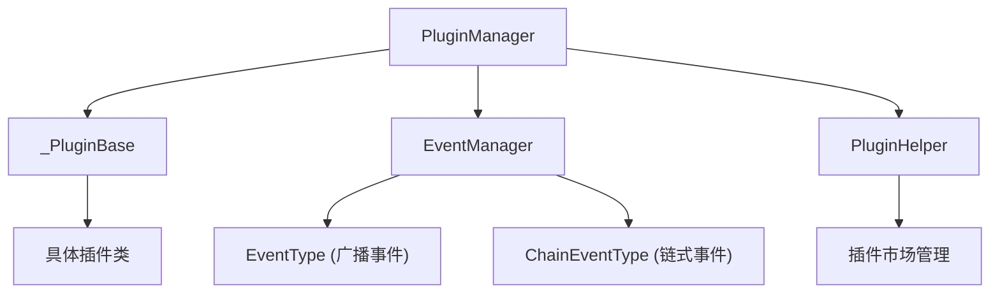
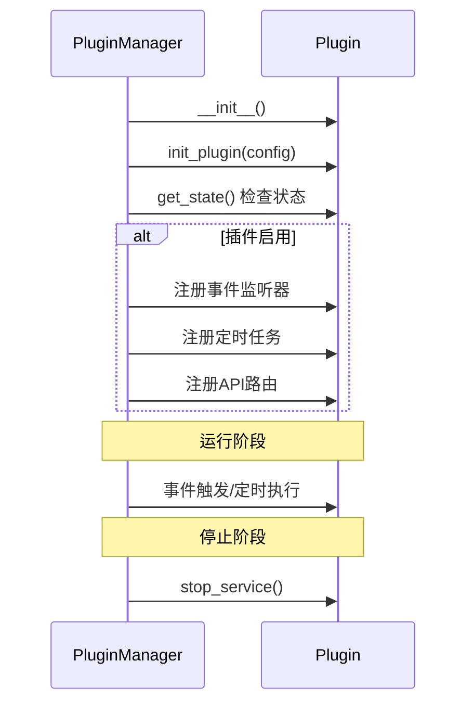

# MoviePilot 插件开发完整指南
> 本文档基于对 MoviePilot 主项目和 MoviePilot-Plugins-Third 第三方插件库的深度分析编写，旨在为插件开发者提供全面的技术参考。
---
## 目录
1. [项目架构概览](#1-项目架构概览)
2. [插件基础结构](#2-插件基础结构)
3. [插件生命周期与核心方法](#3-插件生命周期与核心方法)
4. [事件系统](#4-事件系统)
5. [配置界面开发](#5-配置界面开发)
6. [API 暴露](#6-api-暴露)
7. [定时服务注册](#7-定时服务注册)
8. [远程命令响应](#8-远程命令响应)
9. [仪表板开发](#9-仪表板开发)
10. [消息交互](#10-消息交互)
11. [缓存系统](#11-缓存系统)
12. [智能体工具注册](#12-智能体工具注册)
13. [V2 版本开发与兼容](#13-v2-版本开发与兼容)
14. [版本发布与部署](#14-版本发布与部署)
15. [最佳实践](#15-最佳实践)
---
## 1. 项目架构概览
### 1.1 MoviePilot 主项目结构
```
MoviePilot/
├── app/
│   ├── core/              # 核心模块
│   │   ├── plugin.py      # PluginManager 插件管理器
│   │   ├── event.py       # EventManager 事件管理器
│   │   ├── config.py      # 系统配置
│   │   ├── cache.py       # 缓存系统
│   │   └── ...
│   ├── plugins/           # 插件目录（本地开发）
│   │   └── {plugin_name}/ # 插件子目录
│   │       └── __init__.py
│   ├── helper/            # 辅助类
│   │   ├── plugin.py      # PluginHelper 插件市场管理
│   │   └── ...
│   ├── schemas/           # 数据模型定义
│   │   └── types.py       # 事件类型、枚举定义
│   ├── api/               # FastAPI 接口
│   ├── chain/             # 业务处理链
│   ├── modules/           # 功能模块
│   └── ...
├── requirements.txt
└── ...
```
### 1.2 第三方插件库结构
```
MoviePilot-Plugins-Third/
├── plugins.v2/            # V2版本插件代码目录
│   └── {plugin_name}/     # 插件子目录（必须为插件类名的小写）
│       ├── __init__.py    # 插件主类
│       ├── requirements.txt  # 插件依赖（可选）
│       └── ...            # 其他辅助模块
├── package.v2.json        # V2版本插件清单
├── icons/                 # 插件图标目录
└── README.md
```
### 1.3 核心类关系

---
## 2. 插件基础结构
### 2.1 最小插件示例
```python
from typing import Any, List, Dict, Tuple
from app.plugins import _PluginBase
class my_plugin(_PluginBase):
    """
    插件类名必须与插件目录名一致（小写）
    """
    # ==================== 插件元信息 ====================
    plugin_name = "我的插件"           # 插件显示名称
    plugin_desc = "这是插件描述"       # 插件简介
    plugin_icon = "icon.png"           # 图标（可用icons目录下的文件名或完整URL）
    plugin_version = "1.0.0"           # 版本号
    plugin_author = "作者名"           # 作者
    author_url = "https://github.com/author"  # 作者主页
    plugin_config_prefix = "my_plugin_"  # 配置项前缀
    plugin_order = 10                  # 插件排序（越小越靠前）
    auth_level = 1                     # 用户权限等级（1=所有用户, 2=认证用户）
    def __init__(self):
        super().__init__()
        self._enabled = False
    def init_plugin(self, config: dict = None):
        """插件初始化，在启动和配置更新时调用"""
        if config:
            self._enabled = config.get("enabled", False)
    def get_state(self) -> bool:
        """获取插件状态"""
        return self._enabled
    @staticmethod
    def get_command() -> List[Dict[str, Any]]:
        """注册远程命令"""
        return []
    def get_api(self) -> List[Dict[str, Any]]:
        """注册插件API"""
        return []
    def get_form(self) -> Tuple[List[dict], Dict[str, Any]]:
        """配置页面：返回 (页面配置, 默认数据)"""
        return [], {}
    def get_page(self) -> List[dict]:
        """详情页面"""
        return None
    def stop_service(self):
        """停止插件服务"""
        pass
```
### 2.2 目录命名规范
> **重要：**
> - 插件目录名**必须**为插件类名的**小写**形式
> - 插件命名请勿与官方库插件冲突，否则会被官方插件覆盖
```
plugins.v2/
├── my_plugin/              # 目录名 = 类名小写
│   ├── __init__.py         # 包含类 my_plugin（或 MyPlugin）
│   ├── helper.py           # 辅助模块（可选）
│   └── requirements.txt    # 依赖文件（可选）
```
---
## 3. 插件生命周期与核心方法
### 3.1 生命周期流程

### 3.2 核心方法详解
| 方法 | 调用时机 | 返回值 | 说明 |
|------|----------|--------|------|
| `__init__(self)` | 插件加载时 | None | 初始化实例变量 |
| `init_plugin(config)` | 启动/配置更新 | None | 读取配置，初始化资源 |
| `get_state()` | 状态检查时 | bool | 返回插件是否启用 |
| `get_form()` | 渲染配置页 | Tuple | (页面配置, 默认数据) |
| `get_page()` | 渲染详情页 | List/None | 页面配置JSON |
| `get_command()` | 启动时 | List | 注册远程命令 |
| `get_api()` | 启动时 | List | 注册API端点 |
| `get_service()` | 启动时 | List | 注册定时服务 |
| `stop_service()` | 停止时 | None | 清理资源 |
---
## 4. 事件系统
MoviePilot 采用双轨事件系统：
### 4.1 广播事件（EventType）
异步广播，通知型，不影响主流程。
```python
from app.core.event import eventmanager, Event
from app.schemas.types import EventType
@eventmanager.register(EventType.UserMessage)
def handle_user_message(self, event: Event):
    """监听用户消息"""
    text = event.event_data.get("text")
    userid = event.event_data.get("userid")
    channel = event.event_data.get("channel")
    # 处理逻辑...
```
**常用广播事件类型：**
| 事件类型 | 说明 | 事件数据 |
|----------|------|----------|
| `UserMessage` | 用户发送消息 | text, userid, channel |
| `NoticeMessage` | 发送通知 | channel, type, title, text, image |
| `PluginAction` | 插件动作触发 | action, user, channel, source |
| `TransferComplete` | 整理完成 | 转移相关信息 |
| `DownloadAdded` | 下载已添加 | 下载相关信息 |
| `SubscribeComplete` | 订阅完成 | 订阅相关信息 |
### 4.2 链式事件（ChainEventType）
同步链式，可拦截/修改主流程。
```python
from app.core.event import eventmanager, Event
from app.schemas.types import ChainEventType
@eventmanager.register(ChainEventType.NameRecognize)
def enhance_recognition(self, event: Event):
    """增强名称识别"""
    event_data = event.event_data
    title = event_data.title
    # 修改 event_data 中的结果
    event_data.name = "识别结果"
    event_data.year = "2024"
```
**常用链式事件类型：**
| 事件类型 | 说明 |
|----------|------|
| `NameRecognize` | 名称识别 |
| `TransferRename` | 整理重命名 |
| `TransferIntercept` | 整理拦截 |
| `ResourceSelection` | 资源选择 |
| `DiscoverSource` | 探索数据源 |
| `StorageOperSelection` | 存储操作选择 |
---
## 5. 配置界面开发
### 5.1 Vuetify JSON 配置化开发
插件配置界面使用 [Vuetify](https://vuetifyjs.com/) 组件库的 JSON 配置方式。
```python
def get_form(self) -> Tuple[List[dict], Dict[str, Any]]:
    return [
        {
            'component': 'VForm',
            'content': [
                {
                    'component': 'VRow',
                    'content': [
                        {
                            'component': 'VCol',
                            'props': {'cols': 12, 'md': 6},
                            'content': [
                                {
                                    'component': 'VSwitch',
                                    'props': {
                                        'model': 'enabled',  # 绑定字段名
                                        'label': '启用插件',
                                        'hint': '开启后插件开始工作',
                                        'persistent-hint': True
                                    }
                                }
                            ]
                        },
                        {
                            'component': 'VCol',
                            'props': {'cols': 12, 'md': 6},
                            'content': [
                                {
                                    'component': 'VTextField',
                                    'props': {
                                        'model': 'api_key',
                                        'label': 'API密钥',
                                        'type': 'password',
                                        'clearable': True
                                    }
                                }
                            ]
                        }
                    ]
                }
            ]
        }
    ], {
        "enabled": False,
        "api_key": ""
    }
```
### 5.2 常用组件
| 组件 | 用途 | 关键属性 |
|------|------|----------|
| `VSwitch` | 开关 | model, label |
| `VTextField` | 文本输入 | model, label, type, placeholder |
| `VSelect` | 下拉选择 | model, items, multiple |
| `VAlert` | 提示信息 | type, text, variant |
| `VExpansionPanels` | 折叠面板 | - |
| `VSlider` | 滑块 | model, min, max, step |
### 5.3 属性说明
- `model` 等效于 Vue 的 `v-model`
- `show` 等效于 `v-show`
- 支持表达式：使用 `{{}}` 包裹
- 支持事件：以 `on` 开头，如 `onclick`
---
## 6. API 暴露
### 6.1 注册 API
```python
def get_api(self) -> List[Dict[str, Any]]:
    return [
        {
            "path": "/search",                    # API路径（必须以/开始）
            "endpoint": self.search_api,          # 处理方法
            "methods": ["GET"],                   # 请求方式
            "summary": "搜索资源",                 # API名称
            "description": "根据关键词搜索资源"    # API描述
        },
        {
            "path": "/transfer",
            "endpoint": self.transfer_api,
            "methods": ["POST"],
            "summary": "资源转存",
            "description": "转存资源到指定位置"
        }
    ]
def search_api(self, keyword: str):
    """API处理方法"""
    # 业务逻辑
    return {"code": 0, "data": [...]}
```
### 6.2 API 安全
> **警告：** 暴露 API 时注意安全控制，推荐使用 `settings.API_TOKEN` 进行身份验证。
```python
from app.core.config import settings
def secure_api(self, token: str, data: str):
    if token != settings.API_TOKEN:
        return {"code": 403, "message": "未授权"}
    # 处理逻辑
```
---
## 7. 定时服务注册
### 7.1 注册定时服务
注册后可在「设定-服务」中查看运行状态。
```python
def get_service(self) -> List[Dict[str, Any]]:
    return [
        {
            "id": "my_plugin_sync",     # 服务ID（不能重复）
            "name": "数据同步服务",      # 服务名称
            "trigger": "cron",          # 触发器类型
            "func": self.sync_data,     # 服务方法
            "kwargs": {                 # 定时器参数
                "hour": 2,
                "minute": 0
            }
        },
        {
            "id": "my_plugin_check",
            "name": "状态检查",
            "trigger": "interval",
            "func": self.check_status,
            "kwargs": {"hours": 1}
        }
    ]
def sync_data(self):
    """定时执行的任务"""
    pass
```
### 7.2 触发器类型
| 类型 | 说明 | 参数示例 |
|------|------|----------|
| `cron` | Cron 表达式 | hour, minute, day_of_week |
| `interval` | 固定间隔 | hours, minutes, seconds |
| `date` | 指定时间 | run_date |
---
## 8. 远程命令响应
### 8.1 注册命令
```python
from app.schemas.types import EventType
@staticmethod
def get_command() -> List[Dict[str, Any]]:
    return [
        {
            "cmd": "/my_sync",           # 命令（必须以/开始）
            "event": EventType.PluginAction,
            "desc": "执行同步",           # 命令描述
            "category": "我的插件",       # 命令分类（微信菜单）
            "data": {
                "action": "my_sync"       # 动作标识
            }
        }
    ]
```
### 8.2 响应命令
```python
@eventmanager.register(EventType.PluginAction)
def handle_action(self, event: Event):
    event_data = event.event_data
    if not event_data or event_data.get("action") != "my_sync":
        return
    
    # 获取上下文
    channel = event_data.get("channel")
    user = event_data.get("user")
    
    # 执行命令逻辑
    self.do_sync()
    
    # 回复用户
    self.post_message(
        channel=channel,
        title="同步完成",
        text="数据同步已完成",
        userid=user
    )
```
---
## 9. 仪表板开发
### 9.1 注册仪表板
```python
def get_dashboard_meta(self) -> Optional[List[Dict[str, str]]]:
    """定义仪表板元信息"""
    return [
        {
            "key": "stats",        # 仪表盘唯一标识
            "name": "数据统计"      # 显示名称
        }
    ]
def get_dashboard(self, key: str, **kwargs) -> Optional[Tuple[Dict, Dict, List]]:
    """
    返回仪表板配置
    :returns: (col配置, 全局配置, 页面元素)
    """
    if key != "stats":
        return None
    
    # 列配置
    cols = {"cols": 12, "md": 6}
    
    # 全局配置
    attrs = {
        "refresh": 60,        # 自动刷新间隔（秒）
        "border": True,       # 显示边框
        "title": "数据统计"
    }
    
    # 页面内容（Vuetify JSON）
    elements = [
        {
            "component": "VCard",
            "content": [
                {"component": "VCardText", "text": f"总数: {self._count}"}
            ]
        }
    ]
    
    return cols, attrs, elements
```
---
## 10. 消息交互
### 10.1 发送消息
```python
# 简单消息
self.post_message(
    channel=channel,
    title="标题",
    text="消息内容",
    userid=userid
)
```
### 10.2 按钮交互（Telegram/Slack）
```python
@eventmanager.register(EventType.MessageAction)
def message_action(self, event: Event):
    """处理按钮回调"""
    event_data = event.event_data
    if event_data.get("plugin_id") != self.__class__.__name__:
        return
    
    text = event_data.get("text")
    channel = event_data.get("channel")
    userid = event_data.get("userid")
    
    if text == "confirm":
        self.do_something()
def send_with_buttons(self, channel, userid):
    """发送带按钮的消息"""
    buttons = [
        [
            {"text": "确认", "callback_data": f"[PLUGIN]{self.__class__.__name__}|confirm"},
            {"text": "取消", "callback_data": f"[PLUGIN]{self.__class__.__name__}|cancel"}
        ]
    ]
    
    self.post_message(
        channel=channel,
        title="选择操作",
        text="请选择：",
        userid=userid,
        buttons=buttons
    )
```
---
## 11. 缓存系统
### 11.1 装饰器缓存
```python
from app.core.cache import cached
class MyPlugin(_PluginBase):
    
    @cached(region="my_plugin", ttl=3600)
    def get_cached_data(self, key: str):
        """缓存结果1小时"""
        return expensive_operation(key)
```
### 11.2 TTLCache 类
```python
from app.core.cache import TTLCache
class MyPlugin(_PluginBase):
    def __init__(self):
        super().__init__()
        self.cache = TTLCache(region="my_plugin", maxsize=128, ttl=1800)
    
    def get_data(self, key: str):
        if key in self.cache:
            return self.cache[key]
        
        result = compute_data(key)
        self.cache[key] = result
        return result
```
---
## 12. 智能体工具注册
### 12.1 注册工具
```python
from typing import Type, List
def get_agent_tools(self) -> List[Type]:
    """返回工具类列表"""
    return [MySearchTool]
```
### 12.2 实现工具类
```python
from pydantic import BaseModel, Field
from app.agent.tools.base import MoviePilotTool
class SearchInput(BaseModel):
    query: str = Field(..., description="搜索关键词")
    limit: int = Field(10, description="返回数量")
class MySearchTool(MoviePilotTool):
    name: str = "my_search_tool"
    description: str = "搜索资源工具"
    args_schema: Type[BaseModel] = SearchInput
    
    def get_tool_message(self, **kwargs) -> Optional[str]:
        return f"正在搜索: {kwargs.get('query')}"
    
    async def run(self, query: str, limit: int = 10, **kwargs) -> str:
        # 执行搜索
        results = await self._search(query, limit)
        return f"找到 {len(results)} 条结果"
```
---
## 13. V2 版本开发与兼容
### 13.1 V2 版本目录结构
```
MoviePilot-Plugins/
├── plugins/               # V1版本插件
│   └── my_plugin/
├── plugins.v2/            # V2版本插件
│   └── my_plugin/
├── package.json           # V1插件清单
└── package.v2.json        # V2插件清单
```
### 13.2 版本兼容
```python
from app.core.config import settings
class MyPlugin(_PluginBase):
    def init_plugin(self, config: dict = None):
        if hasattr(settings, 'VERSION_FLAG'):
            version = settings.VERSION_FLAG  # V2
        else:
            version = "v1"
        
        if version == "v2":
            self.setup_v2()
        else:
            self.setup_v1()
```
### 13.3 插件清单 package.v2.json
```json
{
    "my_plugin": {
        "name": "我的插件",
        "description": "插件描述",
        "labels": "工具",
        "version": "1.0.0",
        "icon": "icon.png",
        "author": "作者",
        "level": 1,
        "history": {
            "v1.0.0": "初始版本"
        }
    }
}
```
---
## 14. 版本发布与部署
### 14.1 发布检查清单
- [ ] 更新 `package.v2.json` 版本号
- [ ] 更新 `__init__.py` 中的 `plugin_version`
- [ ] 两边版本号保持一致
- [ ] 编写更新日志 `history`
### 14.2 Level 说明
| Level | 可见范围 |
|-------|----------|
| 1 | 所有用户 |
| 2 | 仅认证用户（需要站点功能时必选） |
| 3 | 需要密钥（测试用） |
### 14.3 Release 发布（可选）
对于文件较多的插件，可使用 Release 打包：
```json
{
    "my_plugin": {
        "release": true,
        "version": "1.0.0"
    }
}
```
Release 包名格式：`{plugin_id}_v{version}.zip`
---
## 15. 最佳实践
### 15.1 日志规范
```python
from app.log import logger
logger.debug("调试信息")
logger.info(f"插件 {self.plugin_name} 已启动")
logger.warning("配置不完整")
logger.error(f"操作失败: {str(e)}")
```
### 15.2 配置管理
```python
from app.db.systemconfig_oper import SystemConfigOper
class MyPlugin(_PluginBase):
    def __init__(self):
        super().__init__()
        self._config_oper = SystemConfigOper()
    
    def save_custom_data(self, key: str, data: any):
        """保存插件数据"""
        self._config_oper.set(f"Plugin_{self.__class__.__name__}_{key}", data)
    
    def get_custom_data(self, key: str):
        """读取插件数据"""
        return self._config_oper.get(f"Plugin_{self.__class__.__name__}_{key}")
```
### 15.3 资源清理
```python
def stop_service(self):
    """停止服务时清理资源"""
    if self._client:
        self._client.close()
        self._client = None
    
    # 清理缓存
    self._cache.clear()
    
    logger.info(f"插件 {self.plugin_name} 已停止")
```
### 15.4 异常处理
```python
def init_plugin(self, config: dict = None):
    try:
        self._client = ApiClient(config.get("api_key"))
        logger.info("API客户端初始化成功")
    except Exception as e:
        logger.error(f"初始化失败: {str(e)}")
        self._enabled = False
        self._client = None
```
---
## 附录
### A. 完整事件类型参考
参见源码：`app/schemas/types.py`
### B. Vuetify 组件参考
官方文档：https://vuetifyjs.com/
### C. 官方插件库
- 官方插件：https://github.com/jxxghp/MoviePilot-Plugins
- 开发指南：https://github.com/jxxghp/MoviePilot-Plugins/blob/main/README.md
---
*文档版本：v1.0*
*生成时间：2026-01-09*
*基于 MoviePilot V2 版本分析*